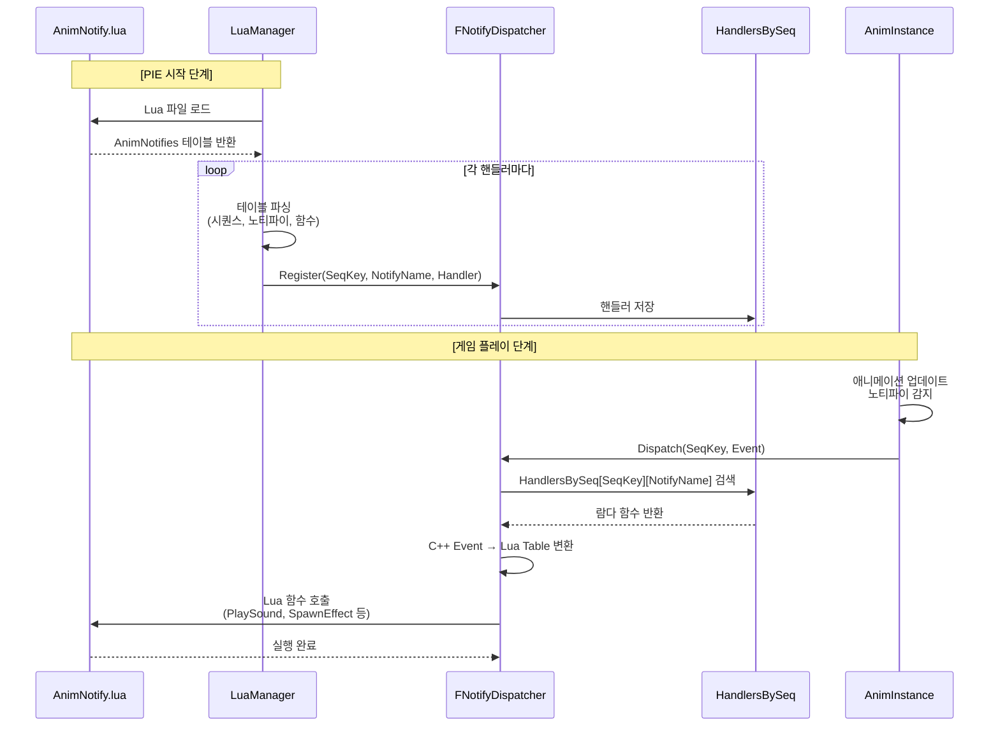
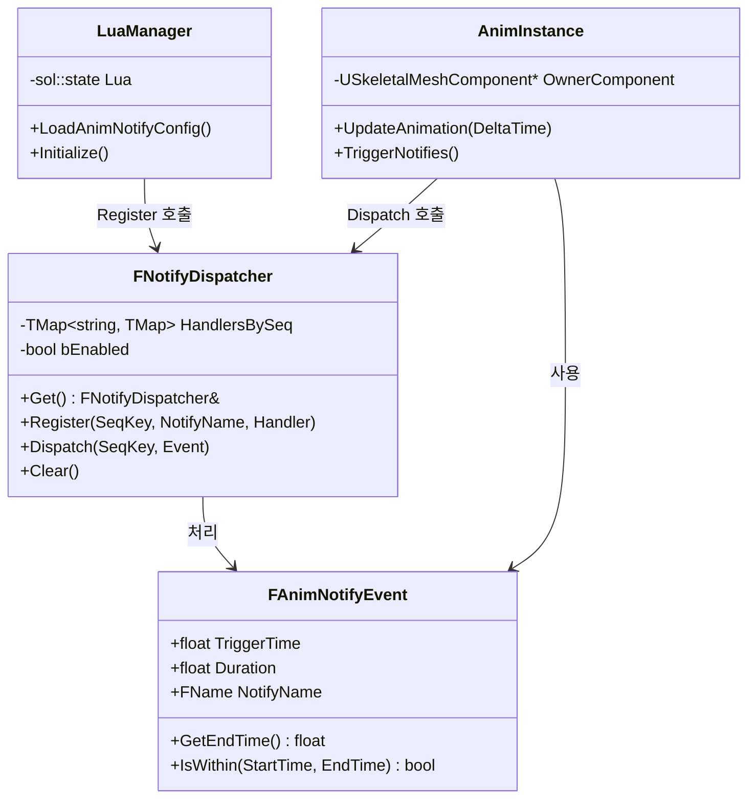

# AnimNotify System Architecture

## 1. 시스템 구조도 (Component Relationship)

```mermaid
flowchart TB
    subgraph LuaLayer["Lua Layer"]
        LuaFile["AnimNotify.lua<br/>핸들러 정의"]
    end

    subgraph CppLayer["C++ Layer"]
        LuaManager["LuaManager<br/>Lua 파일 로드 & 파싱"]
        Dispatcher["FNotifyDispatcher<br/>(싱글톤)<br/>핸들러 저장 & 실행"]
        AnimInstance["AnimInstance<br/>노티파이 트리거"]
    end

    subgraph Storage["Data Storage"]
        HandlerMap["HandlersBySeq<br/>Map&lt;시퀀스, Map&lt;이름, 핸들러&gt;&gt;"]
    end

    LuaFile -->|PIE 시작 시<br/>로드| LuaManager
    LuaManager -->|파싱 후<br/>Register() 호출| Dispatcher
    Dispatcher -->|저장| HandlerMap
    AnimInstance -->|Dispatch() 호출| Dispatcher
    Dispatcher -->|검색| HandlerMap
    HandlerMap -->|핸들러 실행| LuaFile

    style LuaFile fill:#f9f,stroke:#333,stroke-width:2px
    style Dispatcher fill:#bbf,stroke:#333,stroke-width:3px
    style HandlerMap fill:#bfb,stroke:#333,stroke-width:2px
```

---

## 2. 실행 흐름 (Sequence Diagram)



---

## 3. 데이터 구조 (Class Diagram)



---

## 4. 핵심 개념 정리

### FNotifyDispatcher (싱글톤)
- **역할**: 핸들러 중앙 관리
- **데이터**: `TMap<시퀀스키, TMap<노티파이명, 핸들러>>`
- **함수**:
  - `Register()`: 핸들러 등록 (PIE 시작 시)
  - `Dispatch()`: 핸들러 실행 (노티파이 발생 시)

### LuaManager
- **역할**: Lua ↔ C++ 브릿지
- **타이밍**: PIE 시작 시 초기화
- **동작**: Lua 테이블 파싱 → Dispatcher에 등록

### AnimInstance
- **역할**: 노티파이 트리거
- **타이밍**: 매 프레임 애니메이션 업데이트
- **동작**: 시간 구간 검사 → Dispatch 호출

---

## 5. 핵심 장점

1. **O(1) 검색 성능**: 2단계 해시맵
2. **런타임 리로드**: Lua 파일 수정 즉시 반영 가능
3. **확장성**: 새 노티파이 추가 시 Lua만 수정
4. **디버깅**: 자동 로그 출력
5. **멀티 시퀀스**: 여러 애니메이션 독립 관리
