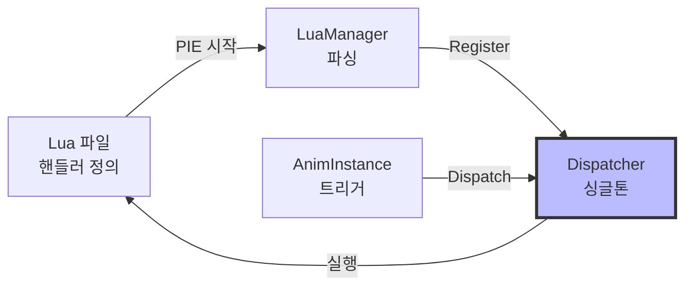
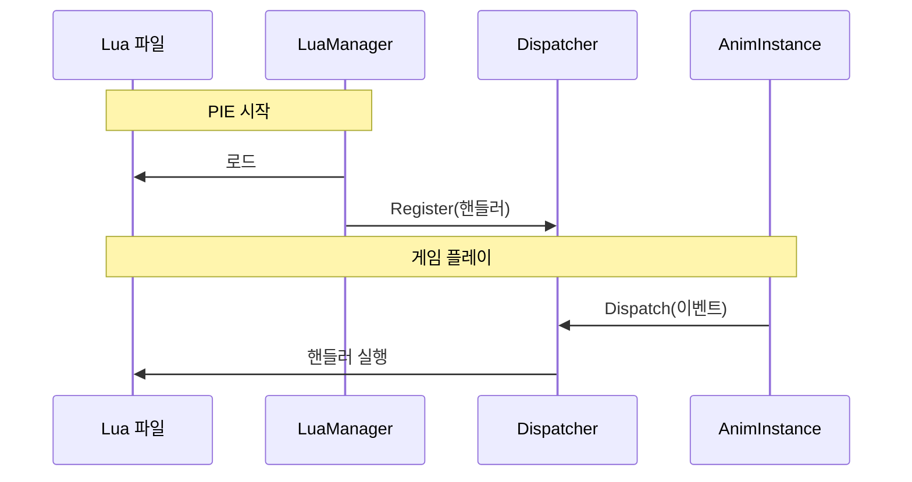
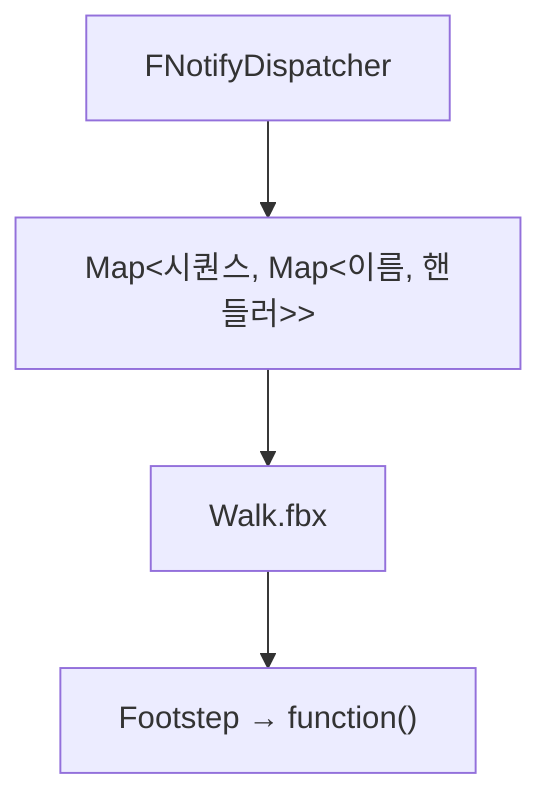

# AnimNotify System - 핵심 구조

## 시스템 구조 (간단 버전)

---

## 실행 흐름

---

## 데이터 구조

---

## 핵심 3단계

1. **등록**: PIE 시작 → Lua 파싱 → Register
2. **저장**: Dispatcher가 2단계 맵에 저장
3. **실행**: 노티파이 발생 → Dispatch → Lua 실행
