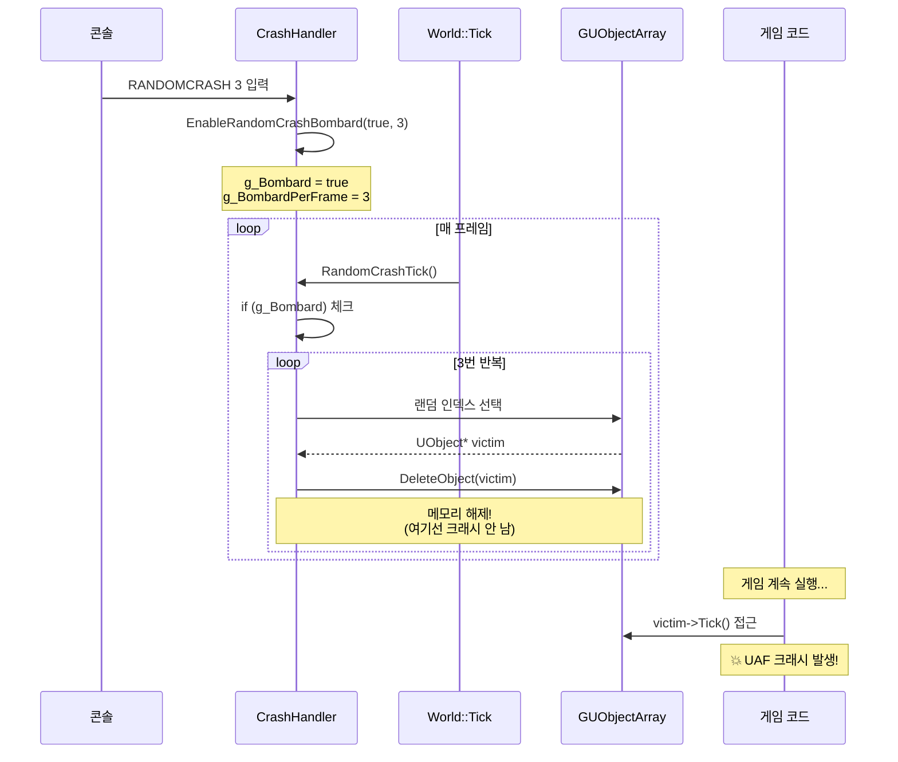
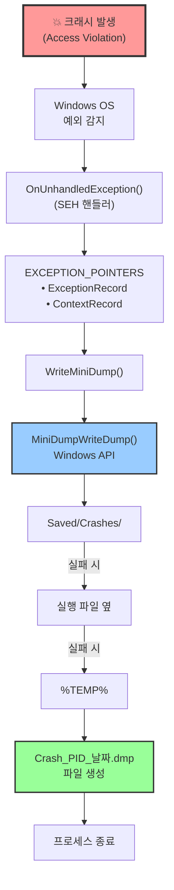
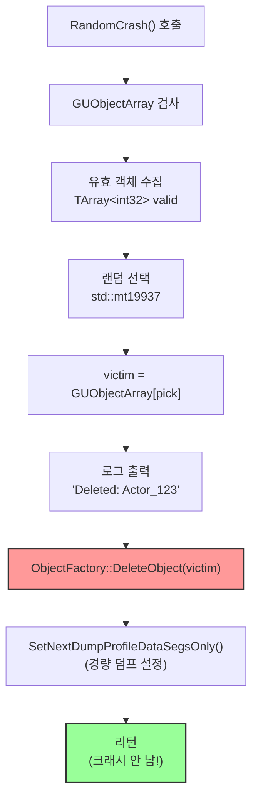
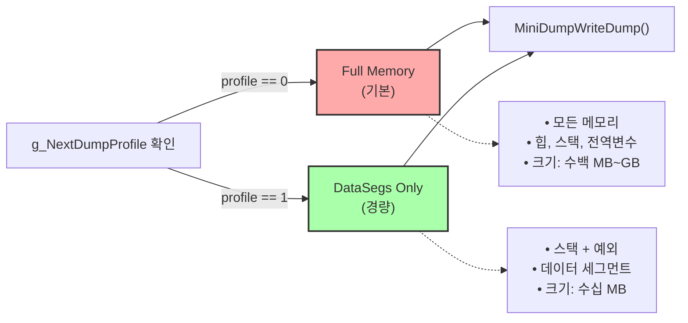

# MiniDump 시스템 흐름

## 1. 랜덤 크래시 발생 흐름

---

## 2. 덤프 파일 생성 흐름

---

## 3. 전체 시스템 통합 흐름

```mermaid
flowchart LR
    subgraph Init["초기화"]
        Start["프로그램 시작"]
        InitHandler["FCrashHandler::Initialize()"]
        SetFilter["SetUnhandledExceptionFilter()"]
    end

    subgraph Runtime["런타임"]
        Cmd["콘솔: RANDOMCRASH"]
        Enable["폭격 모드 ON"]
        Tick["매 프레임<br/>RandomCrashTick()"]
        Delete["랜덤 객체 삭제"]
    end

    subgraph Crash["크래시"]
        UAF["UAF 발생"]
        Exception["예외 핸들러 호출"]
        Dump["덤프 생성"]
    end

    Start --> InitHandler
    InitHandler --> SetFilter
    SetFilter --> Cmd
    Cmd --> Enable
    Enable --> Tick
    Tick --> Delete
    Delete -.->|반복| Tick
    Delete -.->|언젠가| UAF
    UAF --> Exception
    Exception --> Dump

    style UAF fill:#f99,stroke:#333,stroke-width:3px
    style Dump fill:#9f9,stroke:#333,stroke-width:3px
```

---

## 4. 랜덤 크래시 상세 로직

---

## 5. 덤프 타입 결정

---

## 핵심 포인트

### 랜덤 크래시
1. **명령어 1번 입력** → 폭격 모드 활성화
2. **매 프레임 N개씩 삭제** → World::Tick에서 자동 호출
3. **삭제 시점에 크래시 안 남** → 자연스러운 UAF 유도
4. **실제 크래시 사이트 포착** → 디버깅 가치 높음

### 덤프 생성
1. **SEH 핸들러 등록** → Windows 전역 예외 처리
2. **EXCEPTION_POINTERS** → 크래시 순간 스냅샷
3. **3단계 폴백 경로** → 덤프 생성 보장
4. **두 가지 덤프 타입** → Full(기본) / DataSegs(경량)
