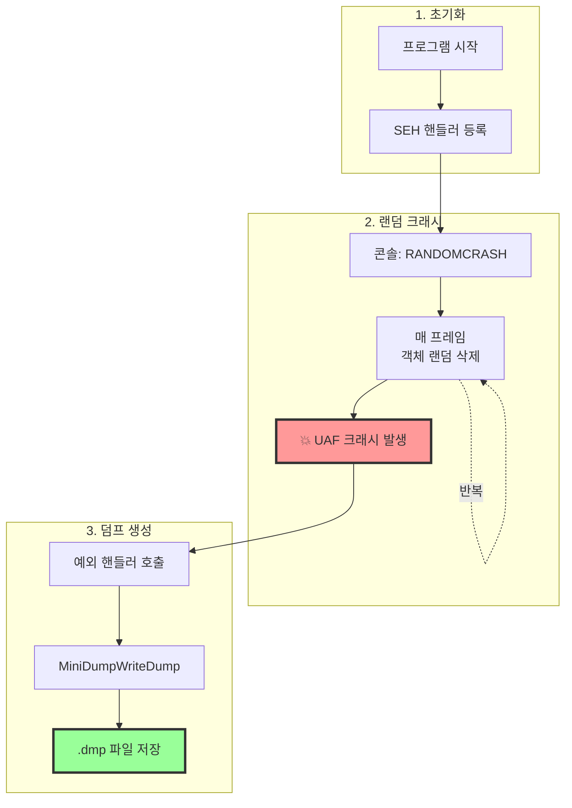

# MiniDump 시스템 - 전체 흐름

## 전체 플로우 (간단 버전)

```mermaid
flowchart TB
    subgraph Init["1. 초기화"]
        Start["프로그램 시작"]
        Handler["SEH 핸들러 등록"]
    end

    subgraph Crash["2. 랜덤 크래시"]
        Cmd["콘솔: RANDOMCRASH"]
        Loop["매 프레임<br/>객체 랜덤 삭제"]
        UAF["💥 UAF 크래시 발생"]
    end

    subgraph Dump["3. 덤프 생성"]
        Catch["예외 핸들러 호출"]
        API["MiniDumpWriteDump"]
        File[".dmp 파일 저장"]
    end

    Start --> Handler
    Handler --> Cmd
    Cmd --> Loop
    Loop -.->|반복| Loop
    Loop --> UAF
    UAF --> Catch
    Catch --> API
    API --> File

    style UAF fill:#f99,stroke:#333,stroke-width:3px
    style File fill:#9f9,stroke:#333,stroke-width:3px
```

---

## 핵심 3단계

1. **초기화**: SEH 예외 핸들러 등록
2. **랜덤 크래시**: 매 프레임 객체 삭제 → UAF 유발
3. **덤프 생성**: 크래시 순간 메모리 스냅샷 저장
